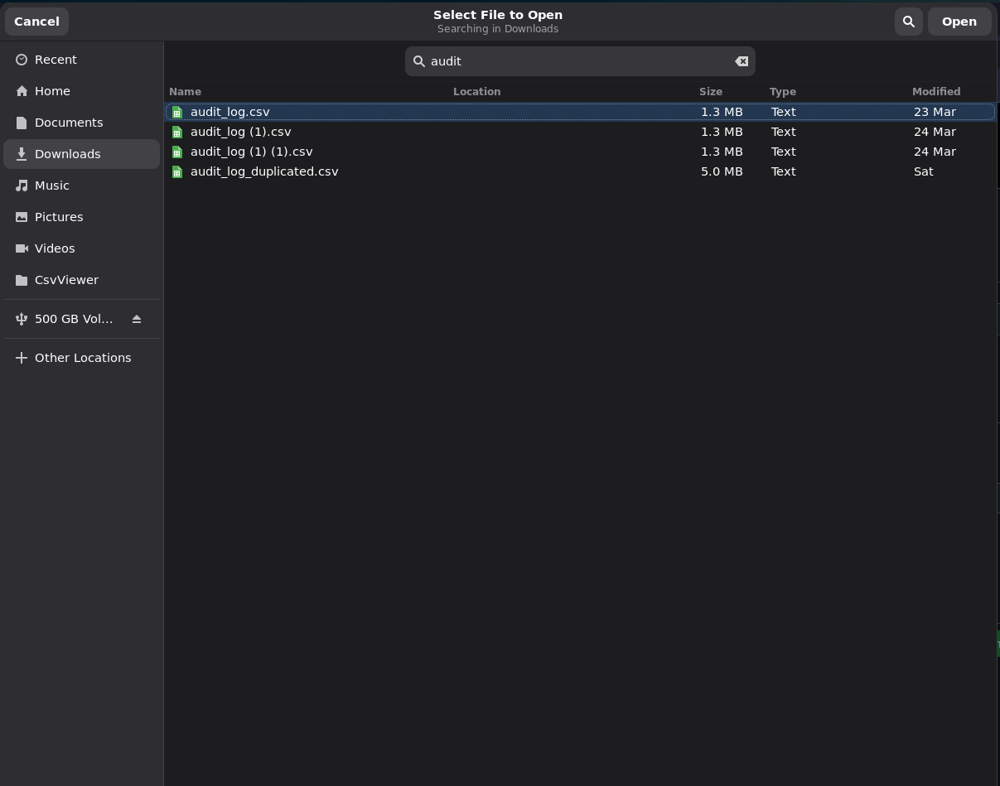
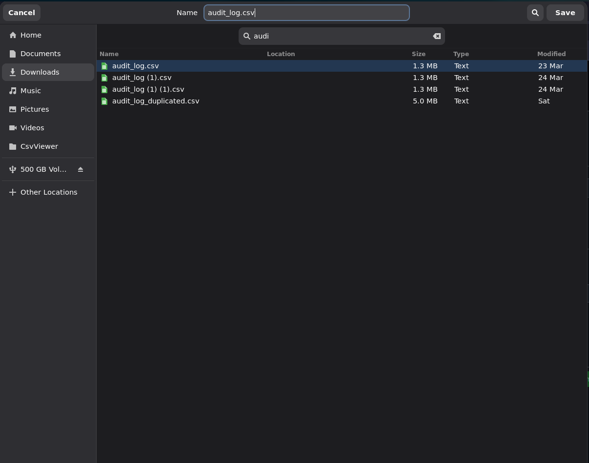
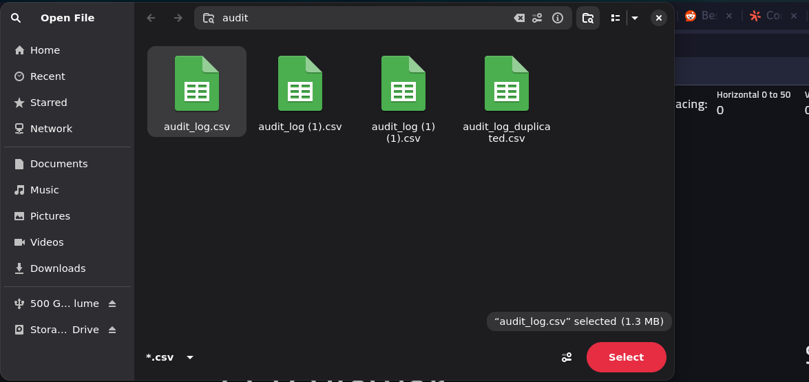
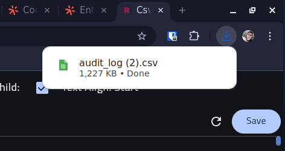
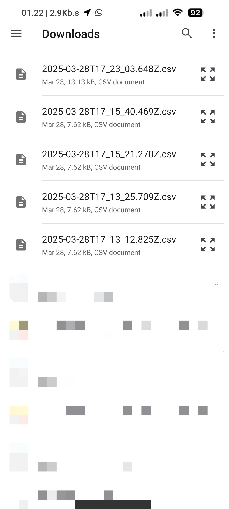
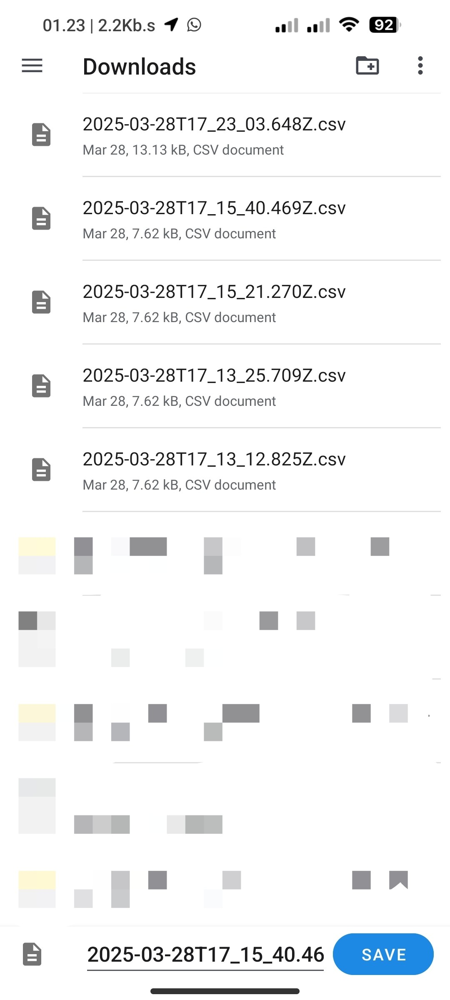

# Kotlin CSV

A lightweight Kotlin Multiplatform library for reading and writing CSV files with a simple, intuitive API. Supports Android, Desktop JVM, and Web (Wasm/JS) platforms.

## Installation

Add the following dependency to your project:

```kotlin
// Kotlin multiplatform
kotlin {
    sourceSets {
        commonMain.dependencies {
            implementation("com.ryinex.kotlin:csv:<latest-version>")
        }
    }
}

// Regular kotlin project
dependencies {
    implementation("com.ryinex.kotlin:csv:<latest-version>")
}
```

## Description

Kotlin CSV provides a streamlined way to handle CSV files across different platforms. Key features include:

- **Multiplatform Support**: Works seamlessly on Android, Desktop JVM, and Web (Wasm/JS) platforms
- **Simple API**: Intuitive builder pattern for creating CSV files
- **Type-Safe Operations**: Strongly typed column definitions
- **Flexible Reading/Writing**: Support for both reading existing CSV files and creating new ones from the filesystem
- **Custom Column Mapping**: Define custom column mappings with type conversion
- **Header Support**: Optional header row handling

Example usage:

```kotlin
// Creating a CSV file
val csvFile = CsvReadWrite.builder(items, isTitled = true)
    .column("Name") { index, item -> item.name }
    .column("Age") { index, item -> item.age }
    .column("Adult") { index, item -> item.age >= 18 }
    .build("output.csv")

// Raw CSV data as string
csvFile.raw()

// Saving CSV file
CsvReadWrite.save(csvFile)

// Reading CSV file
val csvFile = CsvReadWrite.open()
```

**Note for Android Projects:**
Initialize CsvReadWrite in your Activity or Fragment if you plan to use `open` and `save` filesystem functionalities:

```kotlin
// In Activity
override fun onCreate(savedInstanceState: Bundle?) {
    super.onCreate(savedInstanceState)
    CsvReadWrite.bind(this)
}

// In Fragment
override fun onCreateView(/*.....*/): View {
    // ...
    CsvReadWrite.bind(requireActivity())
    return<VIEW>
}
```

The binding ensures proper lifecycle management for CSV filesystem operations in your Android application.

## Screenshots

|                    Open CSV                    |                    Save CSV                    |
|:----------------------------------------------:|:----------------------------------------------:|
|  |  |
|           Select a CSV file to open            |        Choose location to save CSV file        |

### Browser
|                    Open CSV                     |                    Save CSV                     |
|:-----------------------------------------------:|:-----------------------------------------------:|
|  |  |
|            Click to select CSV file             |          File downloads automatically           |

### Android
|                    Open CSV                     |                    Save CSV                     |
|:-----------------------------------------------:|:-----------------------------------------------:|
|  |  |
|      Android System Access Framework Open       |      Android System Access Framework Save       |

## TODO

- **iOS** Support

## License

Apache License 2.0 - See [LICENSE](LICENSE) for details.
